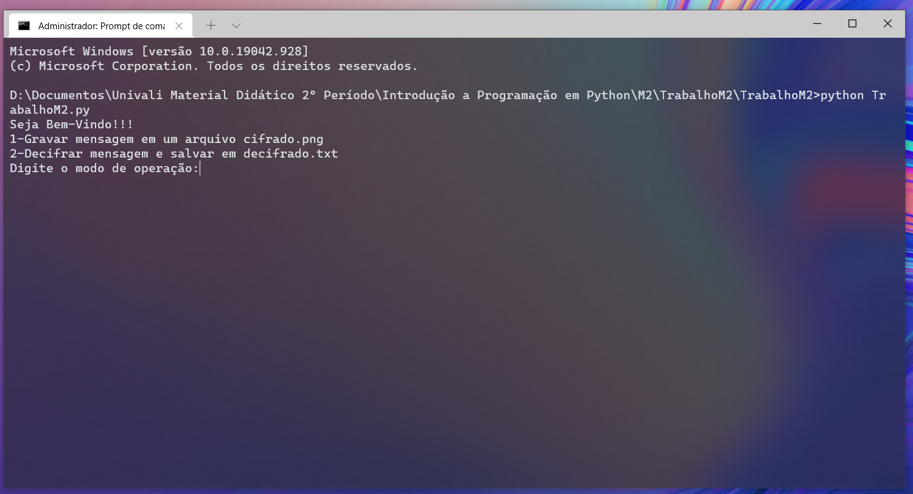
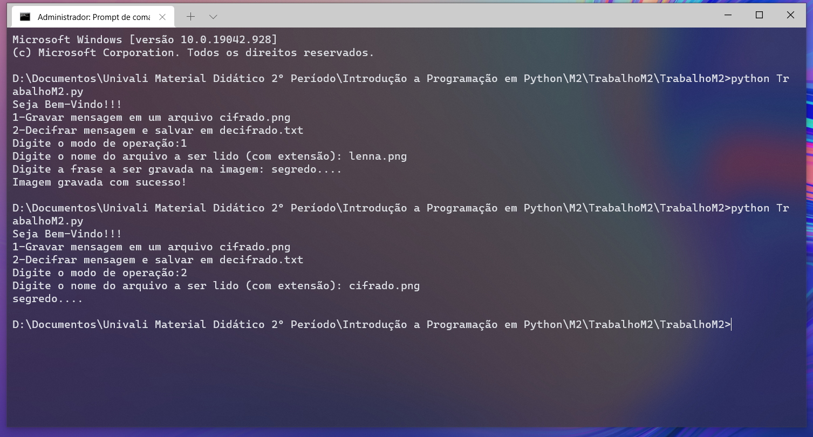

# Mensagens Secretas

Esse é um programa feito em dupla, para a disciplina de Introdução a Programação em Python, onde eu e meu colega Eduardo Amaro Maciel, criamos um programa capaz de armazenar uma mensagem secreta em uma imagem, sem alterá-la de maneira perceptível aos olhos humanos, mas que pode ser decifrada pelo próprio programa.

Isto acontece, pois o programa manipula os bits, da matriz da imagem, do canal de cor azul/verde, os canais menos percebidos pelos olhos humanos. Ele arredonda todos os bits para o número par mais próximo, e em seguida, ele transforma a mensagem secreta em um fluxo bináro, que é salvo nessa mesma camada de cores.
Sendo assim, para ler essa mensagem, ele analise, se o número da camada de cores é par ou impar, e recria o fluxo binário, e por último a mensagem.

Imagens:

